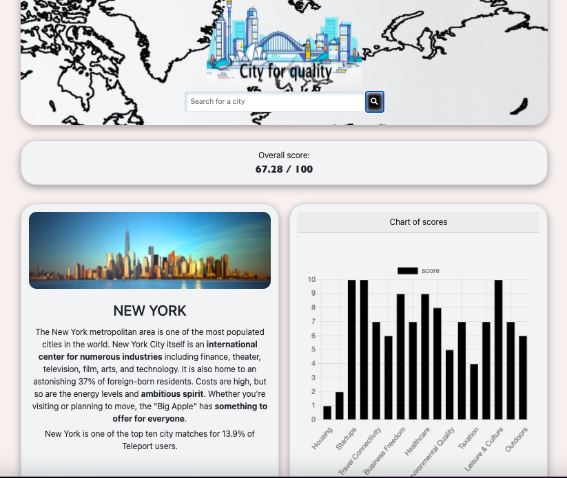
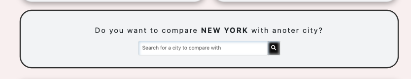
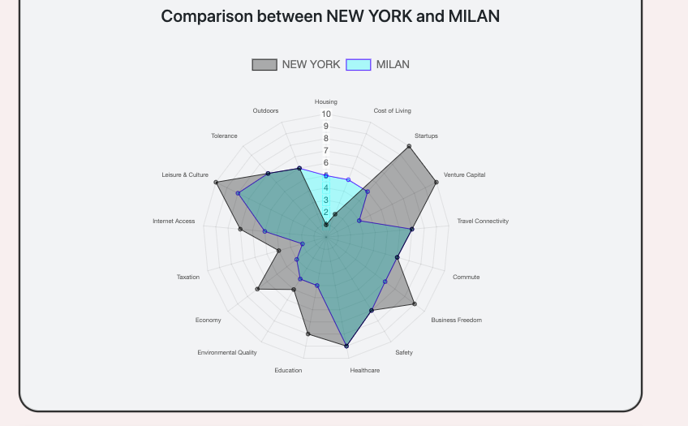

<p align="center">
    
</p>

<details open="open">
  <summary><h2 style="display: inline-block">Contents</h2></summary>
  <ol>
    <li>
      <a href="#about-the-project">About The Project</a>
      <ul>
        <li><a href="#appereance">Appereance</a></li>
        <li><a href="#compare-cities">Compare cities</a></li>
        <li><a href="#built-with">Built With</a></li>
      </ul>
    </li>
    <li>
      <a href="#getting-started">Getting Started</a>
      <ul>
        <li><a href="#prerequisites">Prerequisites</a></li>
        <li><a href="#installation">Installation</a></li>
      </ul>
    </li>
    <li><a href="#links-contacts">Links & Contacts</a></li>
  </ol>
</details>

## About The Project

### Appereance
<div align='center'>

</div>

I have developed an app that allows you to search for a city of your choice and to see information regarding the quality of life, divided into categories. To do this I used the [Teleport API](https://developers.teleport.org/api/getting_started/)

Through the research you can consult data such as: housing, cost of living, startups, venture capital, travel connectivity, commute, business freedom, safety, healthcare, education, environmental quality, economy, taxation, internet access, leisure & culture, tolerance and outdoors.

### Compare cities

<div align='center'>

</div>

In addition you can also compare two cities after searching for the first city and a radar-shaped graph will appear illustrating the differences between the two cities.

<div align='center'>

</div>

### Built With
* [HTML 5](https://developer.mozilla.org/en-US/docs/Glossary/HTML)
* [CSS 3](https://developer.mozilla.org/en-US/docs/Web/CSS)
* [Javascript ES6](https://developer.mozilla.org/en-US/docs/Web/JavaScript?retiredLocale=it)
* [Webpack 5](https://webpack.js.org/blog/2020-10-10-webpack-5-release/)
* [Chart.js](https://www.chartjs.org/docs/latest/)

## Getting Started

### Prerequisites

To start the application you need to have Node.js installed on your computer, so to install the latest version run the following command:

  ```sh
  npm install npm@latest -g
  ```

### Installation

1. Clone the repository with git in the path you prefer:
```sh
 git clone https://github.com/parrodiv/City_Quality_Life.git
```

2. Install NPM packages
 ```sh
  npm install
 ```

3. Build:
```sh
  npm run build
```

4. Open dist/index.html

## Links & Contacts
Linkedin - [Alessandro Parrilla](https://www.linkedin.com/in/alessandro-parrilla-994931222/) - paggio96@gmail.com

Website: https://qualitylifeincities.web.app

